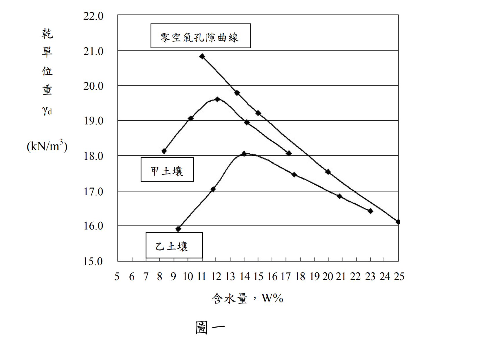

# SM-2013-2 — 標準夯實試驗、曲線族法、最大乾單位重

**來源：** 結構工程技師高考 · 土壤力學與基礎設計 · 第2題
**考年：** 2013（民國102年）
**主分類：** [[SM-U1-3]] 土壤夯實及壓密
**分析法：** 混合
**標籤：** `標準夯實試驗` `曲線族法` `最大乾單位重` `相對夯實度` `混合土`
**驗證狀態：** ✅ verified

---

## 題幹摘要

二、甲乙兩種土壤之標準夯實曲線如圖一所示。一填方工程之回填土係取自某借土區中甲、乙兩種土壤之混合物，吾人取其代表性混合物土樣測得標準夯實試驗之濕單位重為 19.9 $\text{kN/m}^3$，含水量為 11%：
(一)試估計此混合物之最大乾單位重。（8 分）
(二)若此混合土在滾壓後之現地乾單位重為 15.8 $\text{kN/m}^3$，試求其相對夯實度為何？（8 分）
(三)在以此方法決定相對夯實度時，應注意那兩項重點？（9 分）

*圖說：圖為甲、乙兩種土壤之標準夯實曲線。甲土壤峰值約在含水量12%、乾單位重19.6 kN/m³；乙土壤峰值約在含水量14%、乾單位重18.0 kN/m³。*

## 核心考點

本題測驗考生對於實務上「曲線族法 (Family of Curves)」與「單點夯實試驗 (One-Point Compaction Test)」之了解與應用。在土方回填工程中，借土區的土壤往往是不同土層的混合物，若對每一車不同混合比例的土壤都重新做完整夯實試驗將耗費大量時間。因此，實務上可透過已知基礎土壤（甲、乙）建立之曲線族，配合代表性土樣進行單一點的標準夯實試驗，藉由該點在曲線族中的相對內插位置，快速估算該混合物之最大乾單位重與最佳含水量，進而計算現地相對夯實度。
出題者同時要求考生指出此快速估算法的限制條件與注意事項，測驗是否具備實務品管概念。

## 解題關鍵步驟

- **Step 1**：由單點試驗的濕單位重與含水量，計算混合土樣的單點乾單位重。
- **Step 2**：由圖一讀取相同含水量下，甲、乙兩曲線之乾單位重，並計算混合土之內插比例。
- **Step 3**：由圖一讀取甲、乙土壤之最大乾單位重，利用相同的內插比例，估算混合土之最大乾單位重。
- **Step 4**：代入相對夯實度公式求出 RC。
- **Step 5**：列出單點夯實法（曲線族法）的兩大注意事項：(1) 試驗點必須在乾燥側；(2) 土樣需具代表性與同質性。

## 用到的公式

$$\gamma_d = \frac{\gamma_m}{1 + w}$$

$$r = \frac{\gamma_{d,A} - \boxed{\gamma_d}}{\gamma_{d,A} - \gamma_{d,B}} \quad \text{(於相同 } w \text{ 之下)}$$

$$\gamma_{d,max} = \gamma_{d,max,A} - \boxed{r} \cdot (\gamma_{d,max,A} - \gamma_{d,max,B})$$

$$RC = \frac{\gamma_{d,field}}{\boxed{\gamma_{d,max}}} \times 100\%$$

## 涉及陷阱

**陷阱分析：**
- **陷阱 1：** 誤將單點測得之乾單位重 ($17.93 \text{ kN/m}^3$) 直接視為最大乾單位重。必須明白單點試驗僅是用來「定位」混合土在曲線族中的位置，而非該專屬曲線的峰頂。
- **陷阱 2：** 對於第三小題注意事項的回答，若偏離「曲線族法」本身的限制（例如回答成沙漏法測現地密度的注意事項），將無法拿到分數，必須聚焦於此推估最大乾單位重的方法限制。

## 圖形（如有）

_(無)_

## 手寫補充（如有）

_(無)_

## 相關題目

- [[SM-2025-1]] — 一維壓密、壓密度、排水路徑
- [[SM-2024-3]] — 地下水位下降、有效應力、正常壓密
- [[SM-2022-1]] — 夯實試驗、最佳含水量、最大乾單位重
- [[SM-2021-2]] — 正常壓密黏土、壓密沉陷量、時間因數
- [[SM-2019-2]] — 主要壓密沉陷量、時間因數、預壓工法
