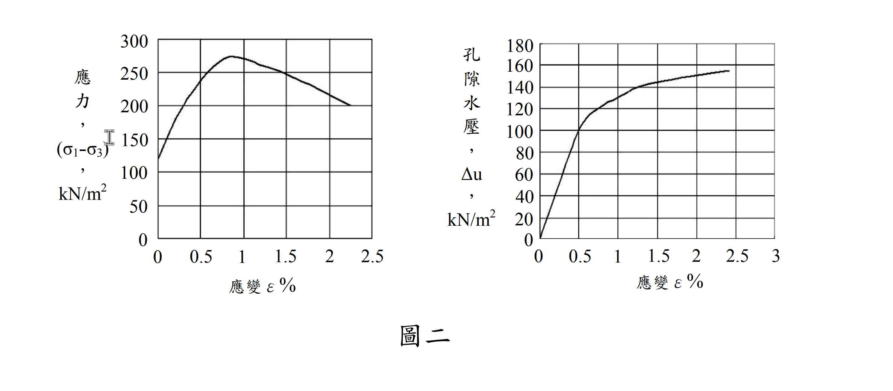

# SM-2013-3 — 三軸試驗、應力路徑、有效應力路徑

**來源：** 結構工程技師高考 · 土壤力學與基礎設計 · 第3題
**考年：** 2013（民國102年）
**主分類：** [[SM-U1-5]] 土壤強度特性與變形性
**分析法：** 有效應力法
**標籤：** `三軸試驗` `應力路徑` `有效應力路徑` `孔隙水壓參數Af` `K0壓密` `不排水剪力強度` `破壞面角度`
**驗證狀態：** ⏳ unverified

---

## 題幹摘要

有一不擾動之黏土樣品，若進行 $K_0$ 不等向壓密不排水軸向壓縮（axial compression, AC）試驗，靜止土壓力係數 $K_0=0.7$，即初始條件為水平壓密應力 $\sigma_{cell}=280 \text{ kN/m}^2$，垂直軸向壓密應力為 $400 \text{ kN/m}^2$，假設初始孔隙水壓為零。此 AC 試驗之應力對應變以及孔隙水壓（$\Delta u$）對應變之結果，如圖二所示。

茲再準備一完全相同之黏土樣品（即孔隙比、含水量等皆保持相同），進行側向伸張試驗（lateral extension, LE），即垂直軸向應力保持一定，而側向壓力減少至試體破壞為止。

(一) 試繪出 AC 與 LE 試驗之總應力與有效應力路徑？（8 分）
(二) 試繪出 LE 試驗中，孔隙水壓對應變圖？（8 分）
(三) 試決定 AC 與 LE 試驗中之破壞時孔隙水壓參數 $A_f$，有效應力抗剪角 $\phi'$，總應力抗剪角 $\phi$ 與破壞面角度？（9 分）

*圖說：考卷圖二，左右兩張皆以軸向應變 $\epsilon$ (%) 為橫軸。左圖為應力差 $(\sigma_1-\sigma_3)$（縱軸 0～300 kN/m²，格線每 50），曲線自 $\epsilon = 0$ 的 $120 \text{ kN/m}^2$（即 $K_0$ 壓密的初始應力差 $400 - 280$）起升，**峰值約 $275 \text{ kN/m}^2$ 落在 $\epsilon \approx 0.9\%$**，其後軟化，至 $\epsilon = 2.25\%$ 降為約 $200$。右圖為孔隙水壓 $\Delta u$（縱軸 0～180 kN/m²，格線每 20），自原點單調上升，在 $\epsilon \approx 0.5\%$ 通過 $100$，**在峰值應變 $\epsilon \approx 0.9\%$ 處約為 $125 \text{ kN/m}^2$**，其後趨緩，$\epsilon = 2.4\%$ 時約 $155$。兩張圖必須在**同一個應變**（峰值處）讀值。*

---

## 核心考點

本題為極高水準之觀念題，主要測試考生對**應力路徑 (Stress Path)**與**有效應力原理**的深刻理解。出題者意圖包含：
1. **有效應力路徑 (ESP) 唯一性**：對於初始狀態相同的同種黏土，在不排水條件下，只要主應力方向不旋轉，不論總應力路徑如何改變（加載或解載），其有效應力路徑與孔隙水壓參數 $A$ 皆視為相同。
2. **總應力與有效應力參數之差異**：引導考生發現，儘管兩試驗的有效應力抗剪角 $\phi'$ 相同，但在不同總應力路徑下（若假設 $c=0$），總應力抗剪角 $\phi$ 會因測試方法 (AC vs LE) 而有顯著差異，凸顯總應力參數非土壤基本性質。
3. **破壞面角度的本質**：測試考生是否知道物理上的破壞面角度應由**有效應力摩擦角 $\phi'$** 控制，而非總應力摩擦角。

---

## 解題關鍵步驟

- **步驟 1：讀取圖表與判定破壞點**
  從圖二中，需準確讀出破壞（應力差峰值）時的對應狀態。觀察左圖，峰值發生在應變 $\epsilon \approx 0.9\%$，此時 $(\sigma_1-\sigma_3)_f \approx 275 \text{ kPa}$；**再回到右圖的同一個應變**讀取，孔隙水壓 $\Delta u_f \approx 125 \text{ kPa}$。
  **兩張圖必須在同一應變讀值**——這是本題最常見的失分點：在左圖找峰值、卻在右圖隨手讀 $\epsilon = 1.0\%$（$\Delta u = 130$），$A_f$、$\phi'$ 就全部帶偏。
- **步驟 2：總應力路徑 (TSP) 分析**
  - **AC 試驗**：側壓不變 ($\Delta \sigma_3 = 0$)，軸壓增加 ($\Delta \sigma_1 > 0$)。
  - **LE 試驗**：軸壓不變 ($\Delta \sigma_1 = 0$)，側壓減少 ($\Delta \sigma_3 < 0$)。
  需注意 LE 試驗中，垂直應力 (400) 始終大於側向應力 (280 遞減)，故大主應力 $\sigma_1$ 始終為垂直向，主應力方向未旋轉。
- **步驟 3：利用 ESP 唯一性求孔壓**
  由 Skempton 參數 $A$ 在相同應變下相等的特性，可推導出 $u_{LE}$ 與 $u_{AC}$ 的直接數學關係，藉此繪製 LE 試驗的水壓變化圖。

## 用到的公式

$$p = \frac{\sigma_1 + \sigma_3}{2} \quad ; \quad q = \frac{\sigma_1 - \sigma_3}{2}$$

$$\Delta u = \Delta \sigma_3 + A_f(\Delta \sigma_1 - \Delta \sigma_3)$$

$$u_{LE} = u_{AC} - \Delta(\sigma_1 - \sigma_3)$$

$$\sin\phi' = \frac{\sigma_{1f}' - \sigma_{3f}'}{\sigma_{1f}' + \sigma_{3f}'}$$

$$\sin\phi_{cu} = \frac{\sigma_{1f} - \sigma_{3f}}{\sigma_{1f} + \sigma_{3f}}$$

$$\theta = 45^\circ + \frac{\phi'}{2}$$

## 涉及陷阱

- **陷阱與應對**：
  - **陷阱**：計算 $\phi$ 與 $\phi'$ 時，許多人不知如何處理凝聚力 $c$。
  - **應對**：由於僅有一組初始壓密狀態，依據考題慣例，針對單一試驗推導 $\phi'$ 與 $\phi$ 時，皆假設過原點 ($c'=0$ 及 $c_{cu}=0$) 進行計算。

---

## 圖形（如有）

- [SM-2013-3-fig-1-chart-reading.svg](../../raw/solutions/SM-2013-3/figs/SM-2013-3-fig-1-chart-reading.svg)
- [SM-2013-3-fig-2-stress-paths.svg](../../raw/solutions/SM-2013-3/figs/SM-2013-3-fig-2-stress-paths.svg)
- [SM-2013-3-fig-3-le-pore-pressure.svg](../../raw/solutions/SM-2013-3/figs/SM-2013-3-fig-3-le-pore-pressure.svg)
- [SM-2013-3-fig-1.png](../../raw/solutions/SM-2013-3/SM-2013-3-fig-1.png)

## 手寫補充（如有）

_(無)_

## 相關題目

- [[SM-2018-2]] — CU試驗、三軸試驗、正常壓密
- [[SM-2012-1]] — 三軸試驗、CU試驗、UU試驗
- [[SM-2010-1]] — UU試驗、三軸試驗、不排水剪力強度
- [[SM-2025-2]] — 三軸試驗、CU試驗、CD試驗
- [[SM-2024-1]] — 三軸試驗、CD試驗、莫爾圓
