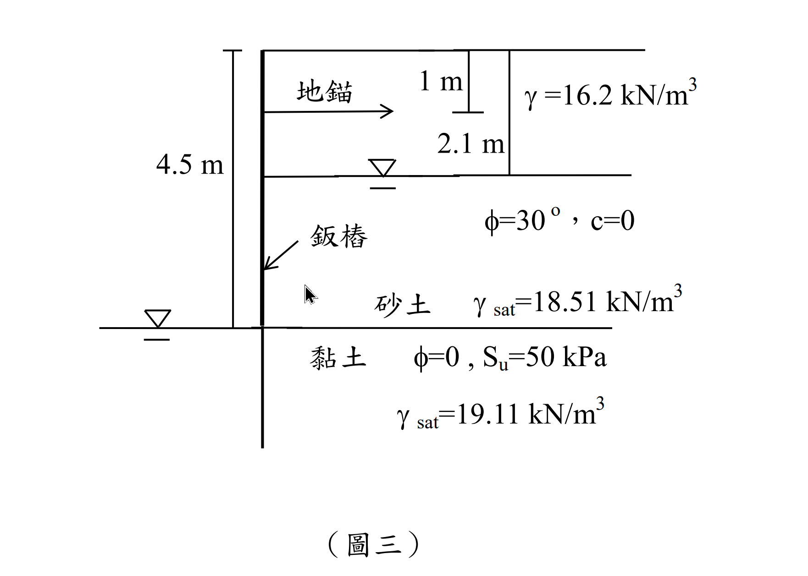

# SM-2014-3 — 開挖穩定性、板樁、自由端支持法

**來源：** 結構工程技師高考 · 土壤力學與基礎設計 · 第3題
**考年：** 2014（民國103年）
**主分類：** [[SM-U2-3]] 開挖之穩定性分析
**副分類：** [[SM-U3-1]] 側向土壓力理論
**分析法：** 混合
**標籤：** `開挖穩定性` `板樁` `自由端支持法` `貫入深度` `地錨預力` `Rankine主動土壓力` `不排水剪力強度`
**驗證狀態：** ⏳ unverified

---

## 題幹摘要

有一 4.5 m 深基地開挖如圖三所示，地表至開挖面為砂土，$\phi=30^\circ$、$c=0$，地下水位於地表下方 2.1 m，地下水位以下與上方之砂土單位重分別為 $18.51 \text{ kN/m}^3$ 與 $16.2 \text{ kN/m}^3$，地錨施設於開挖面頂部下方 1 m 處，開挖面底部為黏土，$\phi=0$ 、不排水剪力強度 $S_u=50 \text{ kPa}$，單位重為 $19.11 \text{ kN/m}^3$，另外為施工考量，開挖面內部水位降至開挖面位置，為穩定該開挖面，試求鈑樁理論貫入深度與地錨預力。（25 分）

*圖說：開挖總深度 4.5 m。擋土牆上方 1 m 處設有地錨。地表至 4.5 m 為砂土（$\phi=30^\circ$, $c=0$），地下水位於 2.1 m 處，其上 $\gamma = 16.2 \text{ kN/m}^3$，其下 $\gamma_{sat} = 18.51 \text{ kN/m}^3$。開挖面（4.5 m）以下為黏土（$\phi=0$, $S_u=50 \text{ kPa}$, $\gamma_{sat} = 19.11 \text{ kN/m}^3$）。開挖側內部水位與開挖面齊平。*

## 核心考點

本題考查**地錨鈑樁牆（Anchored Sheet Pile Wall）**在**黏土層（$\phi=0$）**的貫入深度及地錨力量計算，使用**自由端支持法（Free Earth Support Method）**。
出題者意圖測驗：
1. **多層土與地下水位水壓力**：開挖面以上為砂土，需分層計算有效應力，並正確加上孔隙水壓力。
2. **開挖面以下的淨土壓力（Net Pressure）**：在 $\phi=0$ 之黏土層，了解如何結合上覆土重（$q$）與不排水剪力強度（$S_u$），應用總應力法計算常數之淨側向土壓力 $p_{net} = 4S_u - q$。
3. **力矩與力平衡**：對地錨點取力矩平衡求出理論貫入深度 $D$，再由水平力平衡求出地錨預力。

## 解題關鍵步驟

**作戰計畫：**
1. **計算開挖面以上之主動土壓力與水壓力**：
   - 砂土主動土壓力係數 $K_a = \tan^2(45^\circ - 30^\circ/2) = 1/3$。
   - 計算 $z=0, 2.1, 4.5$ 處的有效垂直應力，乘以 $K_a$ 得到主動土壓力。
   - 計算 $z=2.1$ 至 $z=4.5$ 的靜水壓力。
   - 將土壓力與水壓力分成幾個簡單幾何形狀（三角形、矩形），計算作用力及其相對於地錨點的力臂與力矩。
2. **計算開挖面以下之淨土壓力**：
   - 計算開挖面上方之總覆土壓力 $q$。
   - 應用公式 $p_{net} = 4S_u - q$ 得到開挖面以下的淨側向力均勻分布。
3. **力矩平衡求 $D$**：
   - 列出開挖面以下淨土壓力相對於地錨點的抵抗力矩（含 $D$ 的函數）。
   - 令主動力矩與抵抗力矩相等，解一元二次方程式得 $D$。
4. **水平力平衡求地錨預力 $T$**：
   - 由 $\Sigma F_x = 0$，得 $T = P_A - P_R$。

## 用到的公式

$$K_a = \tan^2\left(45^\circ - \frac{30^\circ}{2}\right) = \frac{1}{3}$$

$$\sigma_v' = 0 \text{ kPa} \implies \sigma_a' = 0 \text{ kPa}$$

$$\sigma_v' = 16.2 \times 2.1 = 34.02 \text{ kPa}$$

$$\sigma_a' = 34.02 \times \frac{1}{3} = 11.34 \text{ kPa}$$

$$u = 0 \text{ kPa}$$

$$\sigma_v' = 34.02 + 8.7 \times (4.5 - 2.1) = 34.02 + 8.7 \times 2.4 = 54.9 \text{ kPa}$$

$$\sigma_a' = 54.9 \times \frac{1}{3} = 18.3 \text{ kPa}$$

$$u = 9.81 \times 2.4 = 23.544 \text{ kPa}$$

$$P_1 = \frac{1}{2} \times 11.34 \times 2.1 = 11.907 \text{ kN/m}$$

$$M_{OT,1} = 11.907 \times 0.4 = 4.7628 \text{ kN-m/m}$$

$$P_2 = 11.34 \times 2.4 = 27.216 \text{ kN/m}$$

$$M_{OT,2} = 27.216 \times 2.3 = 62.5968 \text{ kN-m/m}$$

$$P_3 = \frac{1}{2} \times (18.3 - 11.34) \times 2.4 = \frac{1}{2} \times 6.96 \times 2.4 = 8.352 \text{ kN/m}$$

$$M_{OT,3} = 8.352 \times 2.7 = 22.5504 \text{ kN-m/m}$$

$$P_4 = \frac{1}{2} \times 23.544 \times 2.4 = 28.2528 \text{ kN/m}$$

$$M_{OT,4} = 28.2528 \times 2.7 = 76.28256 \text{ kN-m/m}$$

$$P_A = P_1 + P_2 + P_3 + P_4 = 11.907 + 27.216 + 8.352 + 28.2528 = 75.7278 \text{ kN/m}$$

$$M_{OT} = 4.7628 + 62.5968 + 22.5504 + 76.28256 = 166.19256 \text{ kN-m/m}$$

$$q = \gamma_{sand} \times 2.1 + \gamma_{sat, sand} \times 2.4 = 16.2 \times 2.1 + 18.51 \times 2.4 = 34.02 + 44.424 = 78.444 \text{ kPa}$$

$$p_{net} = 4S_u - q = 4(50) - 78.444 = 200 - 78.444 = 121.556 \text{ kPa}$$

$$P_R = p_{net} \times D = 121.556 D$$

$$M_R = P_R \times (3.5 + 0.5D) = 121.556 D (3.5 + 0.5D) = 425.446 D + 60.778 D^2$$

$$\Sigma M_{anchor} = 0 \implies M_R = M_{OT}$$

$$60.778 D^2 + 425.446 D = 166.19256$$

$$D^2 + 7.000 D - 2.7344 = 0$$

$$D = \frac{-7 + \sqrt{7^2 - 4(1)(-2.7344)}}{2} = \frac{-7 + \sqrt{49 + 10.9376}}{2} = \frac{-7 + 7.7419}{2} = 0.371 \text{ m}$$

$$\boxed{D = 0.371 \text{ m}}$$

$$\Sigma F_x = 0 \implies T + P_R = P_A$$

$$T = P_A - P_R = 75.7278 - 121.556 \times 0.37097$$

$$T = 75.7278 - 45.093 = 30.635 \text{ kN/m}$$

$$\boxed{T = 30.63 \text{ kN/m}}$$

## 涉及陷阱

**陷阱分析：**
- **陷阱 1：水壓力漏算或重複計算**。在有效應力法中，開挖面上方擋土側需加上孔隙水壓力。而在開挖面下黏土層，若使用總應力法推導之 $p_{net} = 4S_u - q$ 公式，已內含了水壓力的平衡，不需再外加水壓力，否則會重複計算。
- **陷阱 2：地錨位置未正確扣除**。所有力矩必須對「地錨點」取矩（本題為 $z=1$ m），若誤對頂部或底部取矩會導致極大誤差。
- **陷阱 3：黏土層單位重誤用**。開挖面下黏土的單位重為 $19.11 \text{ kN/m}^3$，但在計算 $p_{net} = 4S_u - q$ 時，黏土層的自重在主動與被動側相互抵消，故實際上不影響淨土壓力，若誤用會導致公式錯誤。

## 圖形（如有）

- [SM-2014-3-pressure-viz.html](../../raw/solutions/SM-2014-3/SM-2014-3-pressure-viz.html)

## 手寫補充（如有）

_(無)_

## 相關題目

- [[SM-2005-1]] — 板樁、錨定式版樁、自由端支撐法
- [[SM-2022-4]] — 板樁、開挖穩定性、貫入深度
- [[SM-2007-4]] — 板樁、錨定式版樁、固定端支撐法
- [[SM-2020-2]] — 板樁、開挖穩定性、砂湧
- [[SM-2017-4]] — 開挖穩定性、管湧、臨界水力坡降
