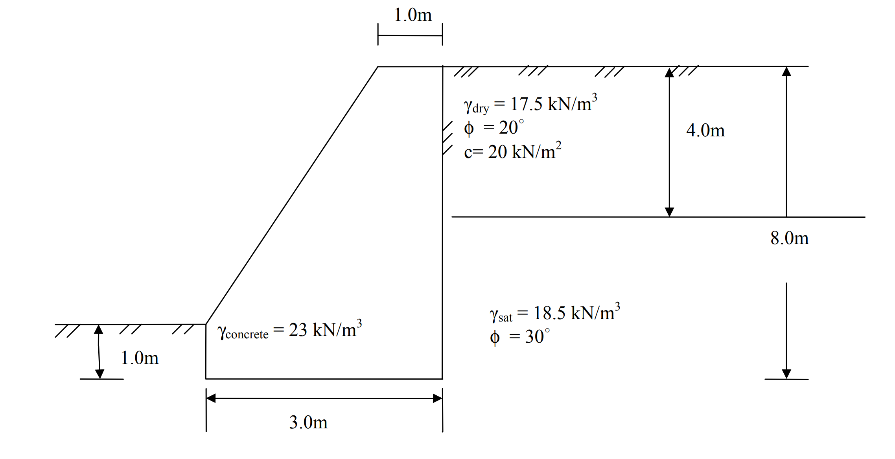

# SM-2015-2 — Rankine主動土壓力、張力裂縫、土壓力合力作用點

**來源：** 結構工程技師高考 · 土壤力學與基礎設計 · 第2題
**考年：** 2015（民國104年）
**主分類：** [[SM-U3-1]] 側向土壓力理論
**副分類：** [[SM-U3-2]] 擋土結構物穩定分析
**分析法：** 混合
**標籤：** `Rankine主動土壓力` `張力裂縫` `土壓力合力作用點` `孔隙水壓` `抗滑動` `安全係數`
**驗證狀態：** ✅ verified

---

## 題幹摘要

有一正常壓密黏土厚 4.0 m，其 $\gamma_{dry} = 17.5 \text{ kN/m}^3$，摩擦角 $\phi = 20^\circ$，凝聚力 $c = 20 \text{ kN/m}^2$，下方為砂土層 $\gamma_{sat} = 18.5 \text{ kN/m}^3$，摩擦角 $\phi = 30^\circ$，該土層之地下水位面位於地表以下 4.0 m。現擬建一 8.0 m 高之擋土牆，其牆背為垂直。
(一) 利用倫金理論（Rankine）計算並繪出牆背所受土壓力分布，並計算其合力及合力作用位置。（15 分）
(二) 檢核擋土牆之抗滑動安全係數是否恰當。（10 分）

*圖說：牆體高度 8.0 m，頂寬 1.0 m，底寬 3.0 m。前趾覆土深度 1.0 m。牆體為混凝土，單位重 $\gamma_{concrete} = 23 \text{ kN/m}^3$。第一層黏土 0~4.0 m，第二層砂土 4.0~8.0 m，地下水位在 4.0 m 深處。*

## 核心考點

1. **Rankine 側向土壓力分布與張力裂縫**：測驗考生是否知道黏土層頂部會產生張力裂縫，且在計算合力時需忽略張力區（深度 $z_c$ 以內）之負值土壓力。
2. **多層土與地下水位之有效應力分析**：測驗在地下水位面以下需切換為有效單位重 $\gamma'$ 及計算水壓力，且水壓力應與土壓力疊加。
3. **擋土牆抗滑動穩定分析**：測驗對驅動力與抵抗力的全面考量。驅動力包含牆背的總側向推力（土壓力加水壓力）；抵抗力包含牆底摩擦力與牆前被動土壓力。其中，牆底揚水壓（Uplift pressure）是否考慮、以及摩擦角 $\delta$ 的選取，是鑑別程度的關鍵。

## 解題關鍵步驟

**步驟化戰略：**
1. **求出各土層參數與 $K_a$、$K_p$**：黏土層與砂土層之主動土壓力係數。
2. **計算有效應力與主動土壓力分布**：分層求出 $z=0, 4, 8\text{ m}$ 的 $\sigma_v'$ 與 $\sigma_a'$。特別求出黏土層的張力裂縫深度 $z_c$。
3. **計算合力與作用點**：將有效土壓力分布切分為三角形與矩形，計算各自面積與力臂，並加上水壓力分布，求得總合力與合力作用點高度。
4. **計算牆身自重與揚水壓**：依牆體幾何求出自重 $W$，假設被動側水位於地表（$z=7\text{ m}$），計算底面揚水壓 $U$，得有效自重 $W'$。
5. **檢核抗滑動安全係數**：求出底面抗滑摩擦力 $F_r$ 與被動土壓力 $P_p$，並與總驅動力對比，判斷 $FS \ge 1.5$ 是否成立。

## 用到的公式

$$K_{a1} = \tan^2\left(45^\circ - \frac{20^\circ}{2}\right) = \tan^2(35^\circ) = 0.4903$$

$$K_{a2} = \tan^2\left(45^\circ - \frac{30^\circ}{2}\right) = \tan^2(30^\circ) = 0.3333$$

$$z_c = \frac{2c_1}{\gamma_{dry}\sqrt{K_{a1}}} = \frac{2(20)}{17.5 \cdot \sqrt{0.4903}} = \frac{40}{12.25} = 3.265 \text{ m}$$

$$FS = \frac{\Sigma F_R}{\Sigma F_D} = \frac{125.12}{197.30} = 0.63$$

## 涉及陷阱

**陷阱分析：**
1. ⚠ **張力裂縫處理**：若直接將 $z=0$ 到 $z=4$ 積分，會誤將負土壓力（拉力）納入抵抗推力，導致不保守。必須求出 $z_c$，僅計算正土壓力區域。
2. ⚠ **水壓力之遺漏**：Rankine 公式只計算「有效土壓力」，若忘記加上水壓力 $P_w$，會大幅低估總推力。
3. ⚠ **底部揚水壓與摩擦角假設**：滑動分析時，牆底往往存在揚水壓力（Uplift），會減少有效正向力，進而降低摩擦力。此外，若題目未給定底面摩擦角 $\delta$，依慣例常取 $\delta = \frac{2}{3}\phi_2$（或保守取值），需於計算中清楚標示假設。

## 圖形（如有）

- [SM-2015-2-pressure-viz.html](../../raw/solutions/SM-2015-2/SM-2015-2-pressure-viz.html)

## 手寫補充（如有）

_(無)_

## 相關題目

- [[SM-2010-2]] — Rankine主動土壓力、土壓力分布圖、水中單位重
- [[SM-2006-3]] — 側向滑動、Rankine主動土壓力、Rankine被動土壓力
- [[SM-2004-3]] — Rankine主動土壓力、孔隙水壓、水中單位重
- [[SM-2025-3]] — 重力式擋土牆、抗滑動、Rankine主動土壓力
- [[SM-2018-4]] — 懸臂式擋土牆、Rankine主動土壓力、抗傾覆
