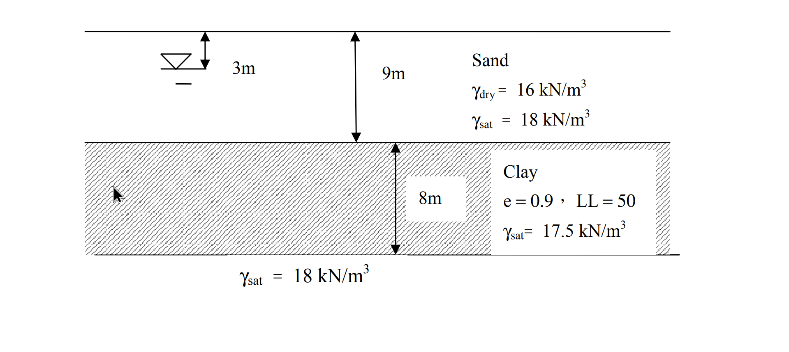

# SM-2015-4 — 抽水降階、Darcy定律、穩定滲流

**來源：** 結構工程技師高考 · 土壤力學與基礎設計 · 第4題
**考年：** 2015（民國104年）
**主分類：** [[SM-U1-3]] 土壤夯實及壓密
**副分類：** [[SM-U1-2]] 土壤滲透、[[SM-U1-4]] 土體內應力
**分析法：** 有效應力法
**標籤：** `抽水降階` `Darcy定律` `穩定滲流` `孔隙水壓` `有效應力原理` `壓密沉陷` `壓縮指數Cc`
**驗證狀態：** ✅ verified

---

## 題幹摘要

一地層如下圖所示，該處地層之孔隙水壓呈靜水壓分布，地下水位面位於地表下 3 m處。該正常壓密黏土，$\gamma_{sat} = 17.5 \text{ kN/m}^3$，$LL = 50$，$e =0.9$，$k = 10^{-7} \text{ m/sec}$。如因長期使用需求將黏土層上方砂土層之水頭抽降 5 m，則對該黏土層之滲流及壓密狀況將造成何種影響？分別計算黏土層單位面積最大滲流量及壓密沉陷量。（25 分）

*圖說：地表下 0~9m 為砂土層（初始地下水位在 3m 處，$\gamma_{dry}=16\text{ kN/m}^3$，$\gamma_{sat}=18\text{ kN/m}^3$）；9~17m 為正常壓密黏土層（厚度 8m，$e=0.9$，$LL=50$，$\gamma_{sat}=17.5\text{ kN/m}^3$，$k=10^{-7}\text{ m/sec}$）；17m 以下為另一 $\gamma_{sat}=18\text{ kN/m}^3$ 之地層（推斷為未受抽水影響之透水層）。*

## 核心考點

1. **穩定滲流與有效應力變化**：測驗考生是否能判斷「僅抽降上方砂土層」會導致黏土層上下邊界產生水頭差，進而引發由下向上的穩定滲流。
2. **非靜水壓狀態之孔隙水壓計算**：在穩定滲流下，黏土層內的孔隙水壓不再是靜水壓分布，而是隨總水頭線性變化，考生需能正確計算滲流狀態下黏土層內部的有效應力。
3. **壓縮指數經驗公式**：測驗考生是否熟悉未提供 $C_c$ 時，可利用液限 $LL$ 透過 Skempton 經驗公式求得。

## 解題關鍵步驟

- **戰略一：滲流分析與水頭界定**
  以黏土層底部為基準面（Elev. 0m）。初始狀態地下水位在 Elev. 14m，黏土層上下水頭皆為 14m。抽水後上方砂土層水頭降 5m（變為 Elev. 9m），下方含水層未抽水（維持 14m），建立向上的水力坡降，以此計算滲流量。
- **戰略二：應力狀態分析**
  計算抽水前與抽水後達穩定滲流時，黏土層中央（代表點）的總應力與孔隙水壓，相減得到初始與最終有效應力。

## 用到的公式

$$\frac{q}{A} = v = k \cdot i = 10^{-7} \text{ m/sec} \times 0.625 = \boxed{6.25 \times 10^{-8} \text{ m/sec}}$$

$$\sigma_{v0} = 3 \times 16 (\text{乾砂}) + 6 \times 18 (\text{飽和砂}) + 4 \times 17.5 (\text{黏土上半}) = 48 + 108 + 70 = 226 \text{ kPa}$$

$$u_0 = (13 - 3) \times 9.81 = 10 \times 9.81 = 98.1 \text{ kPa}$$

$$\sigma'_{v0} = \sigma_{v0} - u_0 = 226 - 98.1 = \boxed{127.9 \text{ kPa}}$$

$$\sigma_{vf} = 8 \times 16 (\text{乾砂}) + 1 \times 18 (\text{飽和砂}) + 4 \times 17.5 (\text{黏土上半}) = 128 + 18 + 70 = 216 \text{ kPa}$$

$$u_f = h_p \times \gamma_w = 7.5 \times 9.81 = 73.575 \text{ kPa}$$

$$\sigma'_{vf} = \sigma_{vf} - u_f = 216 - 73.575 = \boxed{142.425 \text{ kPa}}$$

$$C_c = 0.009(LL - 10) = 0.009(50 - 10) = \boxed{0.36}$$

$$S_c = \frac{C_c H_c}{1 + e_0} \log \left( \frac{\sigma'_{vf}}{\sigma'_{v0}} \right)$$

$$S_c = \frac{0.36 \times 8}{1 + 0.9} \log \left( \frac{142.425}{127.9} \right) = \frac{2.88}{1.9} \log (1.11356)$$

$$S_c \approx 1.5158 \times 0.04671 \approx 0.0708 \text{ m} = \boxed{7.08 \text{ cm}}$$

## 涉及陷阱

- *陷阱*：抽水使上方砂土層中 5m 厚之土壤由飽和（$\gamma_{sat}=18$）變為乾燥（$\gamma_{dry}=16$），故黏土層承受之「總垂直應力」會減少。若誤以為總應力不變，將導致有效應力計算錯誤。
- **戰略三：沉陷量計算**
  利用 Skempton 公式求出壓縮指數 $C_c$，再套用單層壓密沉陷公式求出沉陷量。
  - *陷阱*：有效應力在黏土層上方增加幅度大，底部甚至會因總應力減少而微幅解壓（回脹）。考場標準且最穩妥的作法是以黏土層「中央點」的應力變化為代表，將整層視為單一均質層計算。

## 圖形（如有）

- [SM-2015-4-bearing-viz.html](../../raw/solutions/SM-2015-4/SM-2015-4-bearing-viz.html)

## 手寫補充（如有）

_(無)_

## 相關題目

- [[SM-2024-3]] — 地下水位下降、有效應力原理、正常壓密
- [[SM-2021-1]] — 有效應力原理、總應力、孔隙水壓
- [[SM-2019-2]] — Terzaghi壓密理論、壓密沉陷、壓縮指數Cc
- [[SM-2015-1]] — 壓密沉陷、預壓法、壓密度
- [[SM-2014-4]] — 壓密沉陷、壓密度、時間因數
