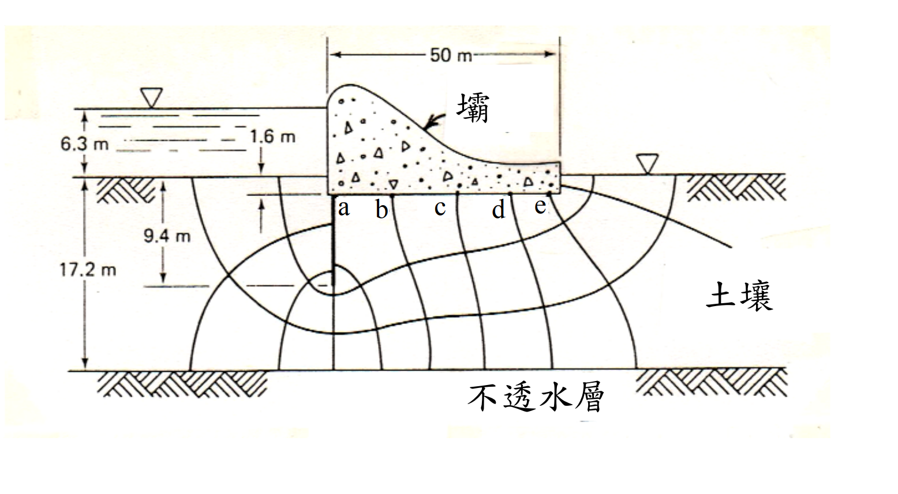

# SM-2018-3 — 流網、滲流量、流槽數Nf

**來源：** 結構工程技師高考 · 土壤力學與基礎設計 · 第3題
**考年：** 2018（民國107年）
**主分類：** [[SM-U1-2]] 土壤滲透
**分析法：** 有效應力法
**標籤：** `流網` `滲流量` `流槽數Nf` `等勢降數Nd` `上揚壓力` `全水頭` `Darcy定律`
**驗證狀態：** ✅ verified

---

## 題幹摘要

三、某混凝土壩，其下方垂直截水牆及流線網如下圖所示。圖中土壤的滲透係數 $k = 3.5 \times 10^{-6}$ m/s。請計算：
(一) 壩底土層之滲流損失（seepage loss）。（5 分）
(二) 於 a、b、c、d、e 點之上揚壓力。（20 分）

*圖說：混凝土壩與垂直截水牆之流線網。上游水面至上游海床距離 6.3m，上游海床至壩底距離 1.6m，截水牆底標示 9.4m，不透水層標示 17.2m。壩底寬 50m，點 a, b, c, d, e 位於壩底。*

## 核心考點

- **流線網判讀能力**：測驗考生是否能正確數出流槽數（$N_f$）與等勢降數（$N_d$）。
- **幾何關係推導**：需從圖面多個尺寸標註中，正確推算出上下游總水頭差（$\Delta H$）以及各點之位置水頭。
- **上揚壓力計算**：測驗考生是否清楚上揚壓力（孔隙水壓）與總水頭、位置水頭之間的關係（$u = h_p \cdot \gamma_w$）。

## 解題關鍵步驟

- **步驟 1：幾何尺寸與水頭差解析**

## 用到的公式

$$q = k \cdot \Delta H \cdot \frac{N_f}{N_d}$$

$$\Delta h = \frac{\Delta H}{N_d}$$

$$h_i = H_{up} - n_i \cdot \boxed{\Delta h}$$

$$u_i = ( \boxed{h_i} - z_i ) \cdot \gamma_w$$

## 涉及陷阱

- **陷阱**：圖面左側標示了 6.3m, 1.6m, 9.4m, 17.2m，基準面為何？部分考生可能誤將 6.3m 直接當作總水頭差。
  - **策略**：觀察尺寸線，17.2m 與 6.3m 的箭頭共用同一水平線（上游海床）。推算截水牆長度 $9.4 - 1.6 = 7.8$ m，與牆底至不透水層距離 $17.2 - 9.4 = 7.8$ m 相等，此幾何對稱性證實這些尺寸皆自上游海床起算。因此總水頭差 $\Delta H = 6.3 + 1.6 = 7.9$ m。
- **步驟 2：判讀流線網參數**
  - 流槽數 $N_f$：計算相鄰流線間的通道數。
  - 等勢降數 $N_d$：沿著與結構物接觸的最上層流線，計算從上游至下游的等勢線區間數。需特別注意截水牆上游面、下游面及壩底的降數分配。
- **步驟 3：計算滲流量與各點上揚壓力**
  - 代入 Darcy 定律的流線網公式 $q = k \cdot \Delta H \cdot \frac{N_f}{N_d}$ 計算滲流損失。
  - 以壩底為基準面（$z=0$），求出各點的總水頭 $h$，再由 $u = (h - z) \cdot \gamma_w$ 求解孔隙水壓。

## 圖形（如有）

- [SM-2018-3-seepage-viz.html](../../raw/solutions/SM-2018-3/SM-2018-3-seepage-viz.html)

## 手寫補充（如有）

_(無)_

## 相關題目

- [[SM-2011-2]] — 流網、Darcy定律、滲透係數
- [[SM-2022-3]] — Darcy定律、滲透係數、等效滲透係數
- [[SM-2021-1]] — 有效應力原理、總應力、孔隙水壓
- [[SM-2015-4]] — 抽水降階、Darcy定律、穩定滲流
- [[SM-2010-3]] — 滲流力、臨界水力坡降、管湧
