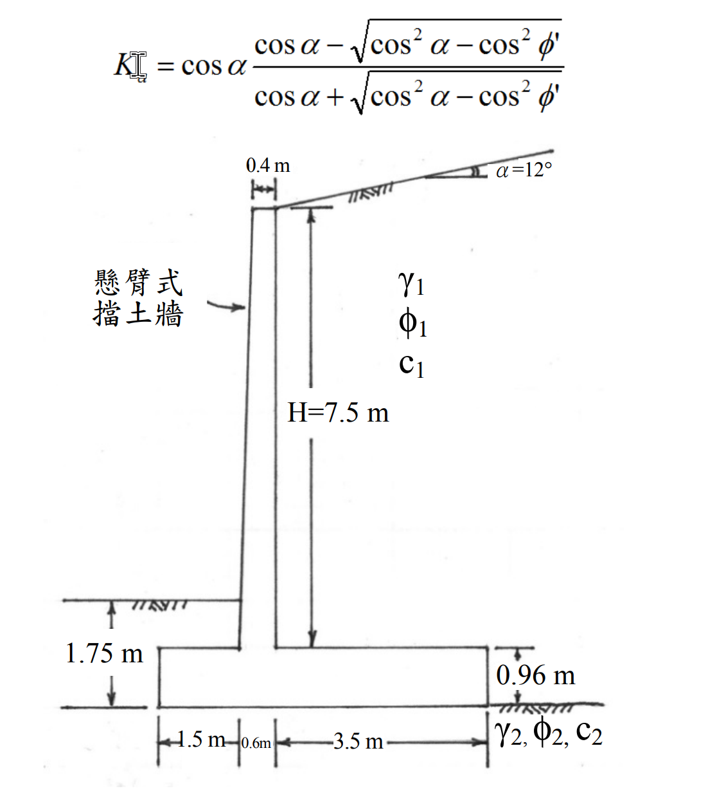

# SM-2018-4 — 懸臂擋土牆、Rankine土壓力、傾覆安全係數

**來源：** 結構工程技師高考 · 土壤力學與基礎設計 · 第4題
**考年：** 2018（民國107年）
**主分類：** [[SM-U3-3]] 坡地工程
**分析法：** 有效應力法
**標籤：** `懸臂擋土牆` `Rankine土壓力` `傾覆安全係數` `滑移安全係數` `傾斜背填土`
**驗證狀態：** ✅ verified

---

## 題幹摘要

某一懸臂式擋土牆如下圖所示，牆高 $H = 7.5 \text{ m}$，背填土傾角 $\alpha= 12^\circ$。
土壤性質：
- 背填土：單位重 $\gamma_1 = 17.8 \text{ kN/m}^3$、有效內摩擦角 $\phi_1 = 32^\circ$、有效凝聚力 $c_1 = 0 \text{ kN/m}^2$
- 基礎土壤：單位重 $\gamma_2 = 16.6 \text{ kN/m}^3$、有效內摩擦角 $\phi_2 = 28^\circ$、有效凝聚力 $c_2 = 30 \text{ kN/m}^2$
- 混凝土單位重 $\gamma_c = 23.55 \text{ kN/m}^3$

被動土壓合力 $P_p = 0 \text{ kN/m}$，基礎底面之介面有效內摩擦角及有效凝聚力折減係數 $k_1 = k_2 = 2/3$。
依據藍金（Rankine）土壓力理論，請計算此擋土牆的：
(一) 抗傾覆安全係數。（13 分）
(二) 抗滑移安全係數。（12 分）

*圖說：牆高 H=7.5m 為莖部高度，牆背垂直、牆面前傾，頂寬0.4m、底寬0.6m；基礎版厚0.96m，趾部伸出1.5m，踵部伸出3.5m。背填土傾角12度，參數標示於牆後。底床土壤參數標示於版底。圖中並附上傾斜地表之 Rankine 主動土壓力係數公式。*

---

## 核心考點

- **虛擬破壞面的建立**：考驗 Rankine 理論應用於懸臂式擋土牆時的標準處理手法，亦即從牆踵（Heel）末端垂直向上建立「虛擬牆背」，並將虛擬牆背與牆身之間的土壤視為擋土牆的一部分。
- **傾斜土壓力的分量**：檢驗傾斜背填土情況下，主動土壓力 $P_a$ 作用於虛擬面上會與水平面夾 $\alpha$ 角（12度），其垂直分量 $P_{ay}$ 對抗傾覆與抗滑動有正面貢獻，不可忽略。
- **介面參數折減**：測試基底摩擦角 $\delta$ 與附著力 $c_a$ 的計算，透過折減係數 $k_1, k_2$ 正確求出抗滑移強度。

---

## 解題關鍵步驟

- **步驟一：幾何計算**。求出擋土牆底版總寬度 $B$，以及牆踵處虛擬垂直面的總高度 $H'$（需計入莖高、版厚及傾斜地表增加的高度）。
- **步驟二：主動土壓力計算**。代入題目給定的 Rankine 傾斜背填土公式計算 $K_a$，再求出總推力 $P_a$ 及其水平分量 $P_{ax}$ 與垂直分量 $P_{ay}$。
- **步驟三：穩定分析列表**。將牆身混凝土、牆上覆土切割為數個簡單幾何區塊，計算各區塊重量（$W$）與對牆趾的力臂（$x$），求得總垂直力 $\Sigma V$ 及抵抗傾覆力矩 $\Sigma M_R$。
- **步驟四：計算安全係數**。
  - 傾覆：$FS_{OT} = \Sigma M_R / M_O$
  - 滑移：$FS_{SL} = \Sigma F_R / P_{ax}$

## 用到的公式

$$H' = H + H_{base} + B_{heel} \tan\alpha = 7.5 + 0.96 + 3.5 \times \tan(12^\circ)$$

$$H' = 8.46 + 3.5 \times 0.21256 = 8.46 + 0.744 = 9.204 \text{ m}$$

$$K_a = \cos 12^\circ \frac{\cos 12^\circ - \sqrt{\cos^2 12^\circ - \cos^2 32^\circ}}{\cos 12^\circ + \sqrt{\cos^2 12^\circ - \cos^2 32^\circ}}$$

$$K_a = 0.9781 \times \frac{0.9781 - \sqrt{0.9568 - 0.7192}}{0.9781 + \sqrt{0.9568 - 0.7192}} = 0.9781 \times \frac{0.9781 - 0.4874}{0.9781 + 0.4874}$$

$$K_a = 0.9781 \times \frac{0.4907}{1.4655} = 0.9781 \times 0.3348 = 0.3275$$

$$P_a = \frac{1}{2} \gamma_1 (H')^2 K_a = 0.5 \times 17.8 \times (9.204)^2 \times 0.3275 = 246.92 \text{ kN/m}$$

$$\Sigma V = \sum W_i + P_{ay} = 70.65 + 17.66 + 126.60 + 467.25 + 23.18 + 21.09 + 51.33 = 777.76 \text{ kN/m}$$

$$\Sigma M_R = \sum M_i = 134.24 + 28.84 + 354.48 + 1798.91 + 102.76 + 15.82 + 287.45 = 2722.50 \text{ kNm/m}$$

$$y_a = \frac{9.204}{3} = 3.068 \text{ m}$$

$$M_O = P_{ax} \times y_a = 241.51 \times 3.068 = 740.95 \text{ kNm/m}$$

$$FS_{OT} = \frac{\Sigma M_R}{M_O} = \frac{2722.50}{740.95} = 3.67$$

$$\delta = k_1 \phi_2 = \frac{2}{3} \times 28^\circ = 18.67^\circ \quad \implies \quad \tan\delta = 0.3378$$

$$c_a = k_2 c_2 = \frac{2}{3} \times 30 = 20 \text{ kN/m}^2$$

$$F_R = c_a B + (\Sigma V) \tan\delta = 20 \times 5.6 + 777.76 \times 0.3378 = 112 + 262.73 = 374.73 \text{ kN/m}$$

$$F_D = P_{ax} = 241.51 \text{ kN/m}$$

$$FS_{SL} = \frac{F_R}{F_D} = \frac{374.73}{241.51} = 1.55$$

## 涉及陷阱

**陷阱分析：**
1. **虛擬平面高度陷阱**：題目標示的 $H=7.5\text{ m}$ 僅為「牆莖高度」。計算土壓力時，必須加上基礎版厚度 $0.96\text{ m}$，以及踵部上方因地表傾斜產生的額外高度 $3.5 \times \tan 12^\circ$。
2. **牆趾覆土**：牆趾上方有 $1.75\text{ m}$（至版底）的覆土，扣除版厚 $0.96\text{ m}$ 後有 $0.79\text{ m}$ 覆土，此部分重量會提供抵抗力矩，在詳細分析時應予計入（保守設計中偶爾忽略，但考試通常建議計入）。
3. **介面摩擦角**：題目敘述「有效內摩擦角...折減係數」，應取 $\delta = k_1 \phi_2$，而非對 $\tan\phi_2$ 進行折減。

---

## 圖形（如有）

- [SM-2018-4-pressure-viz.html](../../raw/solutions/SM-2018-4/SM-2018-4-pressure-viz.html)

## 手寫補充（如有）

_(無)_

## 相關題目

- [[SM-2023-4]] — 深開挖、連續壁、支撐系統失敗
- [[SM-2022-4]] — 懸臂板樁、貫入深度、主動土壓力
- [[SM-2020-2]] — 懸臂式版樁、穩定滲流、土壓力
- [[SM-2017-4]] — 深開挖、打擊式鋼版樁、管湧
- [[SM-2015-2]] — 雙層土、Rankine土壓力、張力裂縫
