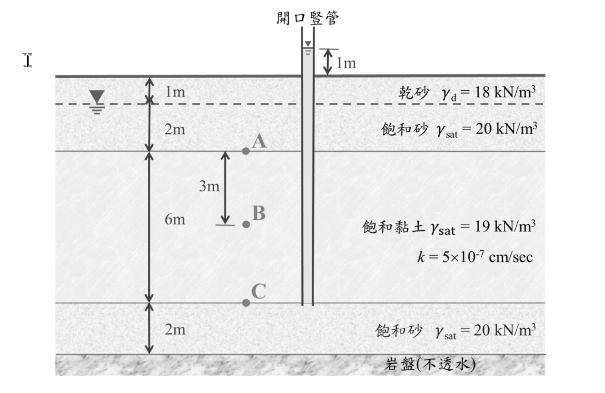

# SM-2021-1 — 有效應力原理、總應力、孔隙水壓

**來源：** 結構工程技師高考 · 土壤力學與基礎設計 · 第1題
**考年：** 2021（民國110年）
**主分類：** [[SM-U1-4]] 土體內應力
**副分類：** [[SM-U1-2]] 土壤滲透
**分析法：** 有效應力法
**標籤：** `有效應力原理` `總應力` `孔隙水壓` `Darcy定律` `總水頭` `湧泉壓力`
**驗證狀態：** ⏳ unverified

---

## 題幹摘要

有一土壤剖面及穩定滲流狀況如下圖所示，黏土層下方之砂土層內已觀察到湧泉壓力，可使開口豎管內的水上升到高於地表面 $1\text{ m}$：（25 分）
(一) 計算 A 點、B 點、C 點之總應力、孔隙水壓及有效應力；
(二) 估計黏土層中滲流之方向及速率。

*圖說：地表至 $1\text{ m}$ 深度為乾砂層（$\gamma_d = 18\text{ kN/m}^3$）；$1\text{ m}$ 至 $3\text{ m}$ 深度為飽和砂層（$\gamma_{sat} = 20\text{ kN/m}^3$），地下水位位於深度 $1\text{ m}$ 處；$3\text{ m}$ 至 $9\text{ m}$ 深度為厚度 $6\text{ m}$ 之飽和黏土層（$\gamma_{sat} = 19\text{ kN/m}^3$，$k = 5 \times 10^{-7}\text{ cm/sec}$）；$9\text{ m}$ 至 $11\text{ m}$ 為底層飽和砂層（$\gamma_{sat} = 20\text{ kN/m}^3$）。開口豎管自底部砂土層接出，水位高出地表 $1\text{ m}$。點 A 位於深度 $3\text{ m}$，點 B 位於深度 $6\text{ m}$，點 C 位於深度 $9\text{ m}$。*

## 核心考點

本題旨在測驗考生對於**一維穩定滲流（Steady-state seepage）**狀態下，總水頭、孔隙水壓及有效應力的計算能力。
核心考點包含：
1. **水頭的定義與計算**：能正確判斷出不同深度的總水頭、位置水頭與壓力水頭（即孔隙水壓）。尤其是下方砂土層具有受壓地下水（Artesian pressure）時，豎管水位的物理意義。
2. **穩定滲流下的水壓分布**：理解在均質土層中發生穩定滲流時，總水頭及孔隙水壓會呈線性分布。
3. **滲流方向及速率判斷**：應用達西定律（Darcy's Law），由總水頭差決定水流方向，並由水力坡降求得滲流速率（流速）。
4. **有效應力原理**：熟練應用 $\sigma' = \sigma - u$ 計算各點之有效應力。

## 解題關鍵步驟

**作戰計畫：**
1. **設定基準面**：以地表面為高程基準面（$z=0$），向下深度為正，高程為負。
2. **計算各點總應力 ($\sigma$)**：由上而下，依各土層之單位重（$\gamma_d, \gamma_{sat}$）乘上厚度累加。
3. **計算各點總水頭 ($H$) 與孔隙水壓 ($u$)**：
   - A 點：上層砂土無滲流（靜水壓狀態），水位於深度 $1\text{ m}$，故 A 點水壓為深度 $1\text{ m}$ 至 $3\text{ m}$ 的靜水壓。
   - C 點：豎管水位高出地表 $1\text{ m}$，可直接求出 C 點壓力水頭及水壓。
   - B 點：為 A、C 間黏土層中點，由於發生穩定滲流，孔隙水壓隨深度線性變化，可藉由內插法或水力坡降求出。
4. **計算各點有效應力 ($\sigma'$)**：直接相減 $\sigma' = \sigma - u$。
5. **判斷滲流方向與速率**：
   - 比較 A 點與 C 點之總水頭（$H_A$ 與 $H_C$），水流由總水頭高處流向低處。
   - 計算水力坡降 $i = \Delta H / L$。
   - 代入達西定律 $v = k \cdot i$ 計算滲流速率。

## 用到的公式

$$\sigma = \sum \gamma_i \cdot \Delta z_i$$

$$H = z + \frac{u}{\gamma_w} \implies u = (H - z) \gamma_w$$

$$\sigma' = \boxed{\sigma} - \boxed{u}$$

$$i = \frac{\Delta H}{L} = \frac{H_C - H_A}{L}$$

$$v = k \cdot \boxed{i}$$

## 涉及陷阱

**陷阱分析：**
- **陷阱 1（孔隙水壓分佈誤判）**：誤以為全深度皆為靜水壓（Hydrostatic pressure）分佈。必須認知到黏土層上下邊界的水頭不一致，因此黏土層內有滲流發生，孔隙水壓不再是單純的 $\gamma_w \cdot z_w$。
- **陷阱 2（豎管水位的解讀）**：未能將「豎管水上升至高於地表 $1\text{ m}$」轉換為 C 點的壓力水頭（$h_p = 10\text{ m}$）。
- **陷阱 3（滲流速率與流量的混淆）**：題目要求估計「速率（velocity）」，即計算滲流流速 $v = ki$ 即可，無需計算流量 $Q$。單位應注意與滲透係數保持一致（例如 $\text{cm/sec}$）。

## 圖形（如有）

- [SM-2021-1-seepage-viz.html](../../raw/solutions/SM-2021-1/SM-2021-1-seepage-viz.html)

## 手寫補充（如有）

_(無)_

## 相關題目

- [[SM-2020-1]] — 有效應力原理、總應力、孔隙水壓
- [[SM-2009-3]] — 有效應力原理、總應力、孔隙水壓
- [[SM-2015-4]] — 抽水降階、Darcy定律、穩定滲流
- [[SM-2022-3]] — Darcy定律、滲透係數、等效滲透係數
- [[SM-2012-1]] — 三軸試驗、CU試驗、UU試驗
