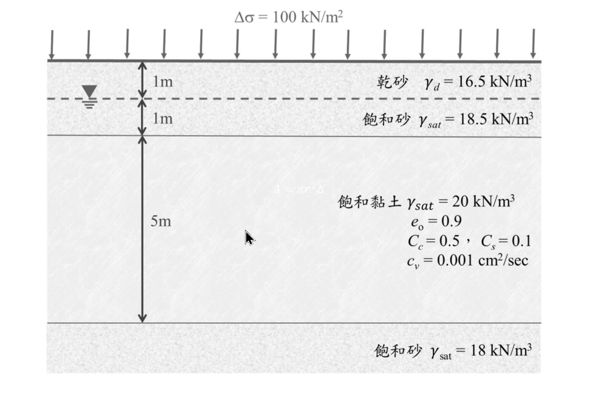

# SM-2021-2 — Terzaghi壓密理論、正常壓密、壓密沉陷

**來源：** 結構工程技師高考 · 土壤力學與基礎設計 · 第2題
**考年：** 2021（民國110年）
**主分類：** [[SM-U1-3]] 土壤夯實及壓密
**分析法：** 有效應力法
**標籤：** `Terzaghi壓密理論` `正常壓密` `壓密沉陷` `壓密係數Cv` `時間因數` `雙面排水`
**驗證狀態：** ⏳ unverified

---

## 題幹摘要

二、有一土壤剖面如下圖所示，由距離地表面 2 m 深度開始，有一厚度為 5 m 之黏土層，此黏土層為正常壓密黏土。現於地表面施加均勻分布的應力 $100 \text{ kN/m}^2$，請計算：（25 分）
(一) 黏土層之主要壓密沉陷量；
(二) 施加應力 1 個月後、2 個月後、3 個月後所得到之壓密沉陷量分別為何？
(三) 施加應力多少天後可以得到 50 cm 的壓密沉陷量？

*圖說：土壤剖面分為三層。第一層為乾砂（厚度 1m，$\gamma_d = 16.5 \text{ kN/m}^3$），其下為地下水位。第二層為飽和砂（厚度 1m，$\gamma_{sat} = 18.5 \text{ kN/m}^3$）。第三層為飽和黏土（厚度 5m，正常壓密黏土，$\gamma_{sat} = 20 \text{ kN/m}^3$, $e_0 = 0.9$, $C_c = 0.5$, $C_s = 0.1$, $c_v = 0.001 \text{ cm}^2/\text{sec}$）。黏土層下方為飽和砂層（$\gamma_{sat} = 18 \text{ kN/m}^3$）。地表面受有均布應力 $\Delta\sigma = 100 \text{ kN/m}^2$。*

## 核心考點

本題核心測驗 Terzaghi 一維壓密理論（1-D Consolidation Theory）的完整應用。出題者的意圖在於評估考生是否具備以下能力：
1. 依據地層剖面正確計算中央深度的初始有效覆土應力 $\sigma_{v0}'$。
2. 針對「正常壓密黏土」正確選用對應之主要壓密沉陷量公式。
3. 判別雙面排水條件以正確決定排水路徑長度 $H_{dr}$。
4. 熟練轉換壓密度 $U$、時間因數 $T_v$ 與真實時間 $t$ 之間的數學關係，並能於 $U \le 60\%$ 及 $U > 60\%$ 兩種情境下運用不同的近似經驗公式。

## 解題關鍵步驟

- **Step 1：計算初始有效應力**。取黏土層中央深度計算初始有效應力 $\sigma_{v0}'$。
- **Step 2：計算最終主要壓密沉陷量**。代入正常壓密（NC）黏土的壓密沉陷公式。
- **Step 3：計算指定時間之沉陷量**。確認為雙面排水，計算 1、2、3 個月對應的 $T_v$，藉此求出壓密度 $U$ 並推算目前的沉陷量。
- **Step 4：計算達特定沉陷量之時間**。由給定之 50 cm 反求壓密度 $U$，再套用對應的 $T_v$ 公式，最終轉為所需天數。

## 用到的公式

$$\sigma_{v0} = \gamma_d \times 1 + \gamma_{sat,砂} \times 1 + \gamma_{sat,黏} \times 2.5$$

$$\sigma_{v0} = 16.5 \times 1 + 18.5 \times 1 + 20 \times 2.5 = 16.5 + 18.5 + 50 = 85 \text{ kN/m}^2$$

$$u = \gamma_w \times (4.5 - 1) = 9.81 \times 3.5 = 34.335 \text{ kN/m}^2$$

$$\sigma_{v0}' = \sigma_{v0} - u = 85 - 34.335 = 50.665 \text{ kN/m}^2$$

$$S_c = \frac{C_c H_c}{1+e_0} \log \left( \frac{\sigma_{v0}' + \Delta\sigma}{\sigma_{v0}'} \right)$$

$$S_c = \frac{0.5 \times 500}{1 + 0.9} \log \left( \frac{50.665 + 100}{50.665} \right) = \frac{250}{1.9} \log(2.9737)$$

$$S_c = 131.579 \times 0.4733 \approx 62.28 \text{ cm}$$

$$\boxed{S_c = 62.28 \text{ cm}}$$

$$U_1 = \sqrt{\frac{4 T_{v1}}{\pi}} = \sqrt{\frac{4 \times 0.04147}{3.1416}} = \sqrt{0.0528} \approx 0.2298 \; (22.98\%)$$

$$U_2 = \sqrt{\frac{4 \times 0.08294}{\pi}} = \sqrt{0.1056} \approx 0.3250 \; (32.50\%)$$

$$U_3 = \sqrt{\frac{4 \times 0.1244}{\pi}} = \sqrt{0.1584} \approx 0.3980 \; (39.80\%)$$

$$\boxed{\text{1個月後：} 14.31 \text{ cm}；\text{2個月後：} 20.24 \text{ cm}；\text{3個月後：} 24.79 \text{ cm}}$$

$$U = \frac{S_t}{S_c} = \frac{50}{62.28} \approx 0.8028 = 80.28\%$$

$$T_v = 1.781 - 0.933 \log(100 - U\%)$$

$$T_v = 1.781 - 0.933 \log(100 - 80.28) = 1.781 - 0.933 \log(19.72)$$

$$T_v = 1.781 - 0.933 \times 1.2949 = 1.781 - 1.2081 = 0.5729$$

$$t = \frac{T_v \cdot H_{dr}^2}{c_v} = \frac{0.5729 \times 250^2}{0.001} = 35,806,250 \text{ sec}$$

$$t_{\text{days}} = \frac{35,806,250}{24 \times 3600} \approx 414.4 \text{ 天}$$

$$\boxed{\text{施加應力約 } 414.4 \text{ 天後可得到 50 cm 之壓密沉陷量}}$$

## 涉及陷阱

**陷阱分析：**
1. **排水路徑判斷（Drainage Path）**：黏土層上方與下方均為砂土（高透水層），因此屬於「雙面排水」。排水路徑 $H_{dr}$ 必須取為厚度的一半（$2.5 \text{ m}$）。若誤以 $5 \text{ m}$ 帶入，會導致時間估算有 4 倍之巨大誤差。
2. **單位一致性**：題目給的壓密係數 $c_v$ 單位為 $\text{cm}^2/\text{sec}$，沉陷量單位也常以 $\text{cm}$ 表達；計算時間因素時，所有長度均須化為 $\text{cm}$，求出之時間單位為 $\text{sec}$，需再轉換為月或天。
3. **水單位重的選用**：計算 $\sigma_{v0}'$ 時需使用水單位重 $\gamma_w$。若未特殊規定，慣例取 $9.81 \text{ kN/m}^3$（此為標準作法），部分考生亦會採用 $10 \text{ kN/m}^3$ 簡化運算，實務上皆為閱卷所接受，本解析採用 $9.81 \text{ kN/m}^3$。

## 圖形（如有）

_(無)_

## 手寫補充（如有）

_(無)_

## 相關題目

- [[SM-2019-2]] — Terzaghi壓密理論、壓密沉陷、壓縮指數Cc
- [[SM-2015-1]] — 壓密沉陷、預壓法、壓密度
- [[SM-2018-1]] — Terzaghi壓密理論、時間因數Tv、壓密度
- [[SM-2014-4]] — 壓密沉陷、壓密度、時間因數
- [[SM-2025-1]] — Terzaghi壓密理論、一維壓密、壓密度
