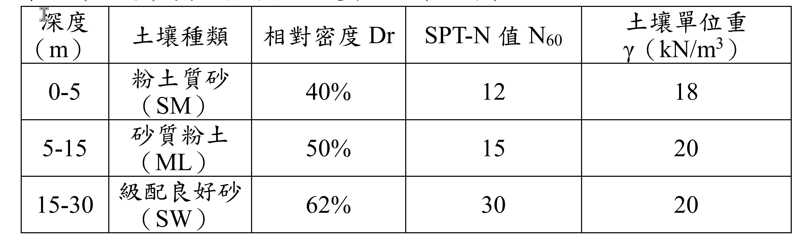

# SM-2023-3 — 打入樁、臨界深度、樁身摩擦力

**來源：** 結構工程技師高考 · 土壤力學與基礎設計 · 第3題
**考年：** 2023（民國112年）
**主分類：** [[SM-U2-2]] 深基礎之支承力與沉陷量
**分析法：** 有效應力法
**標籤：** `打入樁` `臨界深度` `樁身摩擦力` `樁底承載力` `有效應力`
**驗證狀態：** ✅ verified

---

## 題幹摘要

臺灣中南部某工業建築物基礎採用打入式鋼筋混凝土預鑄樁，樁徑為 50 公分、樁長 25 公尺。基地的地下水位在深度 10 公尺處，地層資料如下表。請參照建築物基礎構造設計規範並考慮臨界深度分析：
(一) 樁身極限摩擦力（15 分）
(二) 樁底極限支承力（10 分）

*圖說：深度 0-5m 為粉土質砂 (SM)，Dr=40%，N=12，γ=18 kN/m³；深度 5-15m 為砂質粉土 (ML)，Dr=50%，N=15，γ=20 kN/m³；深度 15-30m 為級配良好砂 (SW)，Dr=62%，N=30，γ=20 kN/m³。地下水位在 10m 處。*

## 核心考點

- **臨界深度觀念（Critical Depth）**：深基礎在砂土中，有效覆土壓力 $\sigma_v'$ 無法隨深度無限增加，在達到臨界深度 $Z_c$（約 $15D \sim 20D$）後，計算摩擦力與端承力所用之 $\sigma_v'$ 即視為常數。
- **參數轉換能力**：給定 SPT-N 值與相對密度 $D_r$，需具備估算土壤內摩擦角 $\phi$ 的能力。
- **地下水位影響**：精確計算地下水位上下的有效應力，特別是水位恰好在臨界深度時的應力分布。

## 解題關鍵步驟

- **步驟 1：決定臨界深度 $Z_c$**。規範對砂土打入樁常取 $Z_c = 20D$。本題樁徑 $D=0.5$m，故 $Z_c = 10$m。
- **步驟 2：計算有效覆土壓力 $\sigma_v'$ 分布**。
  - 【陷阱 1】深度 10m 以下雖然有浮力，但因已達臨界深度，用於計算承載力的 $\sigma_v'$ 必須**維持 190 kN/m² 不變**，不可繼續隨深度增減！
  - 【陷阱 2】地下水位在 10m，10m 以上土壤為濕單位重，10m 以下為飽和單位重（本題給定單一 γ 值，故 10m 以上視為 $\gamma_t$，10m 以下計算若未達臨界深度才需扣除水重，但本題 10m 剛好為臨界深度，因此 10m 以下的承載力有效應力就是 10m 處的有效應力）。
- **步驟 3：估算內摩擦角 $\phi$ 與介面參數**。採用 $\phi = 27^\circ + 0.3 N_{60}$ 估算各層 $\phi$。設定側壓係數 $K=1.0$ 與摩擦角 $\delta = \phi$。
- **步驟 4：分層計算樁身摩擦力 $Q_s$**。因 5~15m 層跨越臨界深度，必須分為 5~10m（應力遞增）與 10~15m（應力常數）兩段計算。
- **步驟 5：計算樁底支承力 $Q_p$**。

## 用到的公式

_(無獨立公式，詳見完整解析)_

## 涉及陷阱

_(本題無特別標註陷阱，詳見解題關鍵步驟)_

## 圖形（如有）

_(無)_

## 手寫補充（如有）

_(無)_

## 相關題目

- [[SM-2024-4]] — 基樁、單樁承載力、樁身長度
- [[SM-2021-3]] — 預鑄基樁、垂直支承力、拉拔力
- [[SM-2014-2]] — 摩擦樁、彈性沉陷、點承載力
- [[SM-2013-4]] — 土壤液化、基礎型式選擇、地層改良
- [[SM-2012-3]] — 基樁、抗拔力、附著因數
