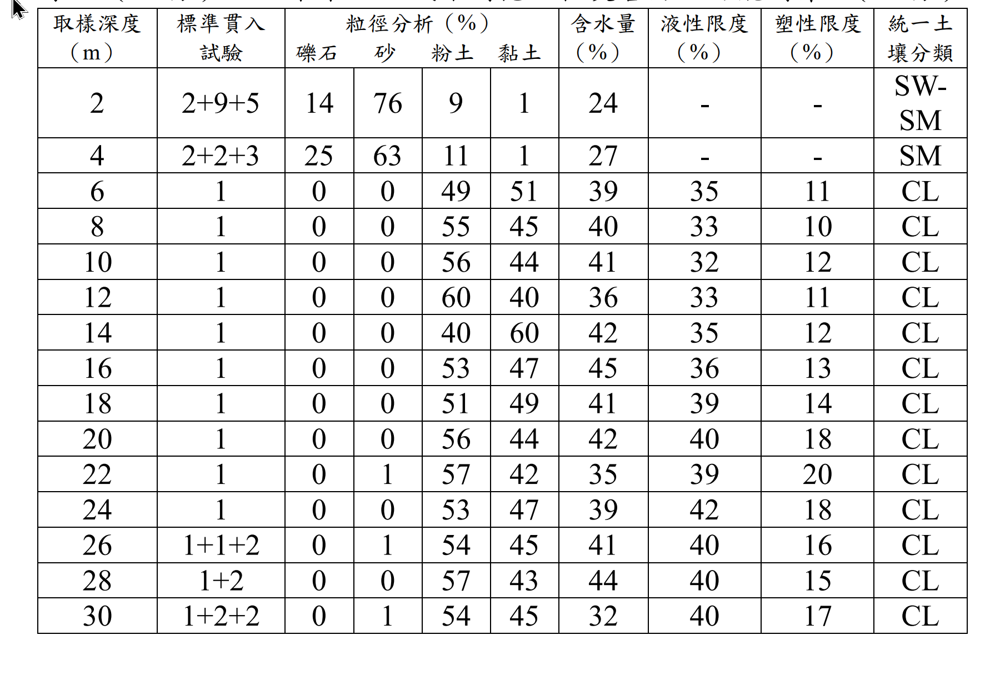

# SM-2023-4 — 深開挖、連續壁、支撐系統失敗

**來源：** 結構工程技師高考 · 土壤力學與基礎設計 · 第4題
**考年：** 2023（民國112年）
**主分類：** [[SM-U3-3]] 坡地工程
**分析法：** 概念題
**標籤：** `深開挖` `連續壁` `支撐系統失敗` `災害防治` `軟弱黏土`
**驗證狀態：** ✅ verified

---

## 題幹摘要

某建案基地為 1000 坪（地上 12 層、地下 3 層），開挖深度 11.95 公尺，採用連續壁深度 24 公尺。進行地下工程時即有鄰近住家反映牆壁龜裂漏水、磁磚掉落等情況，建物沉陷點及建物傾斜計監測數值超過警戒值，地下開挖至第 3 層時，大底未完成即發生支撐系統失敗，造成鄰近多戶民宅嚴重傾斜下陷。工址附近鑽探資料如下表所示。
(一) 請研判事故發生原因（15 分）
(二) 未來此區域深開挖工程災害防治可能對策。（10 分）

*圖說：鑽探柱狀資料表顯示，深度 2m~4m 為砂土層（N=5~14），而深度 6m~24m 為極軟弱之黏土層（CL），標準貫入試驗 N 值全段皆為 1。黏土層含水量約在 35%~45% 之間，液性限度約 32%~42%，塑性限度約 10%~20%。26m 以下 N 值微幅上升至 3~4。*

## 核心考點

本題以實際工程災變案例（極類似 2023 年基泰大直深開挖災變案）為背景，測驗考生能否從鑽探資料中判讀出「極軟弱且高靈敏度」土層的特性，並結合深開挖力學機制，指出導致破壞的核心原因（基底隆起、支撐失敗、連續壁貫入深度不足等），最後提出具體可行的實務防治對策。出題者意圖評估考生對於土壤物理性質（液性指數）如何影響工程行為的敏銳度，以及對深開挖擋土與地盤改良工法的熟悉度。

## 解題關鍵步驟

1. **判讀鑽探資料**：
   - 觀察 N 值：深度 6m~24m 的 N 值皆為 1，為極軟弱黏土。
   - 計算液性指數（Liquidity Index, LI）：判斷土壤是否具高靈敏度。
2. **分析破壞原因（四大面向）**：
   - **土質因素**：高靈敏度極軟弱黏土。
   - **力學機制**：開挖深度達 11.95m，易引發基底隆起（Basal heave）。
   - **擋土設計**：連續壁深 24m 恰好停在 N=1 的軟弱層，無良好嵌固層，易發生踢腳破壞。
   - **施工因素**：大底未完成，內支撐可能無法承受土體擾動後驟增的側向土壓力。
3. **提出防治對策（四大面向）**：
   - **土質改善**：各種地盤改良工法（如 DCM, JSG）以增加基底承載力。
   - **結構設計**：加深連續壁至堅實層、採用 Top-Down 工法等。
   - **施工管理**：分區快挖早撐、控制擾動。
   - **監測應變**：落實監測與緊急應變機制。

## 用到的公式

$$PI = LL - PL$$

$$LI = \frac{w - PL}{\boxed{PI}}$$

## 涉及陷阱

- **陷阱**：未充分利用表格中的含水量與阿太堡限度（液性限度、塑性限度）進行計算，僅憑 N=1 判斷軟弱。應具體計算液性指數（LI > 1）以證明其「流動性」及「高靈敏度」。

## 圖形（如有）

- [SM-2023-4-liquidity-viz.html](../../raw/solutions/SM-2023-4/SM-2023-4-liquidity-viz.html)

## 手寫補充（如有）

_(無)_

## 相關題目

- [[SM-2022-4]] — 懸臂板樁、貫入深度、主動土壓力
- [[SM-2020-2]] — 懸臂式版樁、穩定滲流、土壓力
- [[SM-2018-4]] — 懸臂擋土牆、Rankine土壓力、傾覆安全係數
- [[SM-2017-4]] — 深開挖、打擊式鋼版樁、管湧
- [[SM-2015-2]] — 雙層土、Rankine土壓力、張力裂縫
