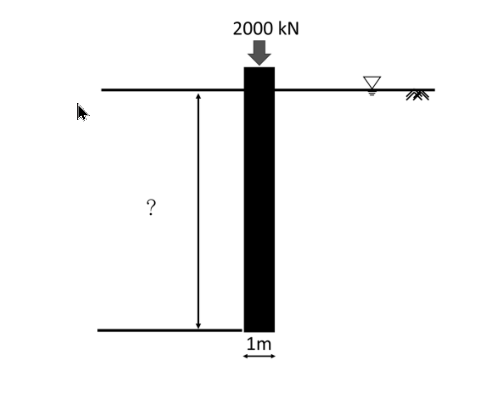

# SM-2024-4 — 樁基承載力、α法、臨界深度

**來源：** 結構工程技師高考 · 土壤力學與基礎設計 · 第4題
**考年：** 2024（民國113年）
**主分類：** [[SM-U2-2]] 深基礎之支承力與沉陷量
**副分類：** [[SM-U1-1]] 土壤基本性質
**分析法：** 混合
**標籤：** `樁基承載力` `α法` `臨界深度` `端點承載力` `摩擦力` `三相關係` `安全係數`
**驗證狀態：** ✅ verified

---

## 題幹摘要

直徑 $1\text{ m}$ 的混凝土樁需承受 $2000\text{ kN}$ 垂直載重，若安全係數為 $2.5$ 的情況下，請計算在兩種不同地層中，需要的設計樁長分別是多少？並繪出樁身阻抗分布圖。

1. **黏土層**：飽和單位重 $21\text{ kN/m}^3$、平均不排水剪力強度 $c_u = 60\text{ kPa}$。
2. **飽和砂土層**：摩擦角 $\phi = 38^\circ$、濕土單位重 $17.98\text{ kN/m}^3$、含水量 $16\%$。

**已知參數與公式：**
- $FS = 2.5$、$N_q^* = 20$、$N_c^* = 9$、$p_a \approx 100\text{ kPa}$。
- 黏土層樁尖承載力 $Q_p = A_p \times c_u \times N_c^*$；樁身摩擦力 $Q_s = p \times L \times \alpha \times c_u$。
- 砂土層臨界深度 $L_c = 15D$；樁尖承載力 $Q_p = A_p \times q' \times N_q^*$。
- 砂土層極限樁底阻抗 $q_l = 0.5 \times p_a \times N_q^* \times \tan(\phi)$。
- 砂土樁身摩擦力：$Q_{s1(0\sim15D)} = \frac{1}{2} \times p \times L_c \times K_0 \times \sigma_0' \times \tan(0.8\phi)$；$Q_{s2(>15D)} = p \times L_2 \times K_0 \times \sigma_0' \times \tan(0.8\phi)$。

*圖說：直徑 1m 的樁承受 2000 kN 載重，地下水位位於地表，需計算未知樁長 L。*

---

## 核心考點

本題旨在測驗考生對於**深基礎承載力**的完整計算流程，包含：
1. **總應力法 (黏土層)**：利用 $\alpha$ 法計算摩擦力，並能查表對應正確的 $\alpha$ 值。
2. **有效應力法 (砂土層)**：理解**臨界深度 (Critical Depth, $15D$)** 觀念。樁深超過 $15D$ 後，有效應力與單位摩擦力不再隨深度增加，而是保持定值；同時樁底極限阻抗也受限於 $q_l$ 上限值。
3. **土壤三相參數轉換**：給定濕土單位重與含水量，要求考生自行推算飽和單位重與有效單位重，這是大地工程計算中最經典的陷阱與基本功。

---

## 解題關鍵步驟

**戰略地圖：**
1. **黏土層**：
   - 確認極限載重 $Q_u = Q_{all} \times FS$。
   - 計算樁端面積 $A_p$ 與周長 $p$。
   - 透過 $c_u/p_a$ 查表求得 $\alpha$。
   - 直接代入公式 $Q_u = Q_p + Q_s$ 解出樁長 $L$。
2. **飽和砂土層**：
   - **土層參數轉換**：假設 $G_s = 2.65$，由 $\gamma_m$ 及 $w$ 求得 $\gamma_d$，進而推求孔隙比 $e$ 與飽和單位重 $\gamma_{sat}$，並得到水下有效單位重 $\gamma'$。
   - **靜止土壓力係數**：採用 $K_0 = 1 - \sin\phi$。
   - **臨界深度阻抗**：計算深度 $15D$ 處的有效應力 $\sigma_{0}'$ 與單位摩擦力。
   - **樁端承載力檢核**：計算 $Q_p$，並嚴格檢核是否超過上限 $q_l \times A_p$。
   - **分段計算摩擦力**：計算 $0\sim 15D$ 區段的 $Q_{s1}$，將剩餘需要的承載力交由 $>15D$ 區段的 $Q_{s2}$ 承擔，解出下段樁長 $L_2$，最後加總得到總長。

## 用到的公式

$$Q_u = Q_{all} \times FS = 2000 \times 2.5 = 5000 \text{ kN}$$

$$A_p = \frac{\pi}{4} D^2 = \frac{\pi}{4} (1)^2 \approx 0.7854 \text{ m}^2$$

$$p = \pi D = \pi(1) \approx 3.1416 \text{ m}$$

$$\frac{c_u}{p_a} = \frac{60}{100} = 0.6$$

$$\alpha = 0.62$$

$$Q_p = 0.7854 \times 60 \times 9 = 424.12 \text{ kN}$$

$$5000 = 424.12 + (p \times L \times \alpha \times c_u)$$

$$5000 = 424.12 + (3.1416 \times L \times 0.62 \times 60)$$

$$4575.88 = 116.87 \times L$$

$$L = \frac{4575.88}{116.87} \approx 39.15 \text{ m}$$

$$\gamma_d = \frac{\gamma_m}{1+w} = \frac{17.98}{1+0.16} = 15.50 \text{ kN/m}^3$$

$$\gamma_d = \frac{G_s \gamma_w}{1+e} \implies 15.50 = \frac{2.65 \times 9.81}{1+e} \implies 1+e = 1.677 \implies e = 0.677$$

$$\gamma_{sat} = \frac{G_s + e}{1+e} \gamma_w = \frac{2.65 + 0.677}{1.677} \times 9.81 = 19.46 \text{ kN/m}^3$$

$$\gamma' = \gamma_{sat} - \gamma_w = 19.46 - 9.81 = 9.65 \text{ kN/m}^3$$

$$\sigma_0' = \gamma' \times 15 = 9.65 \times 15 = 144.75 \text{ kPa}$$

$$f_{s,max} = K_0 \cdot \sigma_0' \cdot \tan(0.8\phi) = 0.384 \times 144.75 \times \tan(30.4^\circ) = 55.58 \times 0.5867 = 32.61 \text{ kPa}$$

$$q_l = 0.5 \times p_a \times N_q^* \times \tan\phi = 0.5 \times 100 \times 20 \times \tan(38^\circ) = 1000 \times 0.7813 = 781.3 \text{ kPa}$$

$$Q_p = A_p \times q_p = 0.7854 \times 781.3 = 613.6 \text{ kN}$$

$$Q_{s1} = \frac{1}{2} \times p \times L_c \times f_{s,max} = 0.5 \times 3.1416 \times 15 \times 32.64 = 769.1 \text{ kN}$$

$$Q_{s2} = Q_u - Q_p - Q_{s1} = 5000 - 613.6 - 769.1 = 3617.3 \text{ kN}$$

$$Q_{s2} = p \times L_2 \times f_{s,max} \implies 3617.3 = 3.1416 \times L_2 \times 32.64 = 102.54 L_2$$

$$L_2 = \frac{3617.3}{102.54} \approx 35.28 \text{ m}$$

$$L = L_c + L_2 = 15 + 35.28 = 50.28 \text{ m}$$

## 涉及陷阱

**陷阱分析：**
- **陷阱一：濕土單位重直接當作飽和或有效單位重使用**。題目明示地層為「飽和砂土層」，且水位於地表，但給予「濕土單位重與含水量」，這意味著必須自行推算 $\gamma_{sat}$ 與 $\gamma'$，若直接把 $17.98$ 拿來扣除水重，將導致後續有效應力全錯。
- **陷阱二：忘記檢核極限樁底阻抗 $q_l$**。砂土層中 $q' N_q^*$ 往往會非常巨大，本題有特別提供 $q_l$ 上限公式，計算後會發現 $q_p$ 會被 $q_l$ 控制（封頂）。
- **陷阱三：摩擦力公式中 $K_0$ 的取值**。題目給定了含 $K_0$ 的經驗公式，一般若未特別標示，砂土的靜止土壓力係數應自行帶入 $K_0 = 1 - \sin\phi$。

---

## 圖形（如有）

_(無)_

## 手寫補充（如有）

_(無)_

## 相關題目

- [[SM-2023-3]] — 打入樁、臨界深度、摩擦力
- [[SM-2021-3]] — 樁基承載力、α法、β法
- [[SM-2007-3]] — 樁基承載力、端點承載力、摩擦力
- [[SM-2012-3]] — 樁基承載力、抗拔力、α法
- [[SM-2005-4]] — 墩基、樁基承載力、端點承載力
