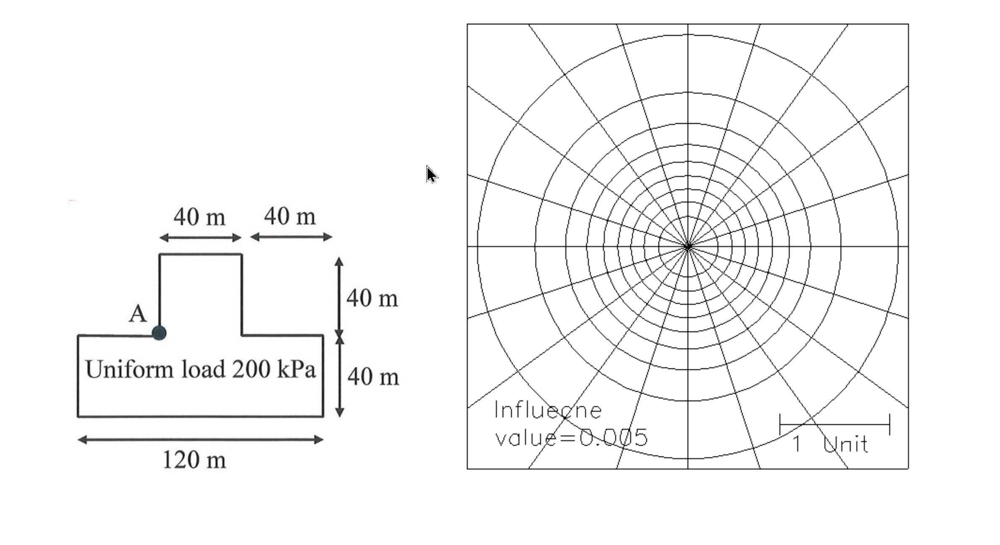

# SM-2025-4 — Boussinesq理論、應力增量、角隅公式

**來源：** 結構工程技師高考 · 土壤力學與基礎設計 · 第4題
**考年：** 2025（民國114年）
**主分類：** [[SM-U1-4]] 土體內應力
**分析法：** 總應力法
**標籤：** `Boussinesq理論` `應力增量` `角隅公式` `疊加原理` `Newmark影響圖`
**驗證狀態：** ⏳ unverified

---

## 題幹摘要

一均布荷重 200 kPa 透過 T 形鐵板作用在地面，如下圖所示。請估算在 A 點下方 40 m 處所受之應力增量。（25 分）
幾何特徵如下：
- 總底部寬度為 120 m，底部長方形（底版）高度為 40 m。
- 頂部凸出長方形（牆身）高度為 40 m。
- 頂部左右兩側的缺口寬度各為 40 m（亦即凸出長方形的寬度為 $120 - 40 - 40 = 40$ m）。
- A 點位於左側內角隅處（即左側缺口與凸出長方形交界點）。
- 附圖另提供一張 Newmark 影響圖（Influence value = 0.005，比例尺 "1 Unit"）。

*圖說：地面受倒 T 形均布載重 200 kPa 作用，總底寬 120m，底版與凸出部高度皆為 40m，兩側缺口各 40m 寬。求 A 點角隅下方 40m 處之垂直應力增量。*

## 核心考點

本題測驗 Boussinesq 彈性理論中計算矩形面載重引起的垂直應力增量。出題者刻意提供 Newmark 影響圖，但也給了非常整齊的幾何尺寸（全是 40m 的倍數，正好與深度 $z=40$m 相同），意在測試考生是否具備「疊加原理」與「圖形拆解」的能力。考生可選擇透過角隅公式精確計算，或者利用影響圖繪圖並數格子，兩條路徑皆能抵達相同的解答。

## 解題關鍵步驟

**戰略地圖：**
- **Step 1:** 將複雜的倒 T 形拆解成數個以 A 點為角隅的矩形。
  根據相對 A 點的位置，載重面積可拆解為三個部分：
  1. 上方矩形（凸出部）：寬 $40\text{m}$，高 $40\text{m}$。
  2. 左下矩形（左側底版）：寬 $40\text{m}$，高 $40\text{m}$。
  3. 右下矩形（中間與右側底版合計）：寬 $120 - 40 = 80\text{m}$，高 $40\text{m}$。
- **Step 2:** 計算各矩形的無因次幾何參數 $m = B/z$ 與 $n = L/z$（給定深度 $z=40\text{m}$）。
- **Step 3:** 利用 Fadum 角隅解公式（或查表、或對應 Newmark 圖）求出三個矩形的影響係數 $I_1, I_2, I_3$。
- **Step 4:** 將三個影響係數相加，乘上均布載重 $q=200\text{ kPa}$，求得總應力增量 $\Delta\sigma_z$。

## 用到的公式

$$m = \frac{B}{z}, \quad n = \frac{L}{z}$$

$$I = f(m,n) \text{ (Fadum 影響係數)}$$

$$I_{total} = I_1 + I_2 + I_3$$

$$\Delta\sigma_z = q \times \boxed{I_{total}}$$

## 涉及陷阱

**陷阱分析：**
1. **形狀解讀錯誤：** 圖示的標示方式（頂部左右箭頭 40m，底部 120m）容易讓人誤解為十字形或正T形。必須仔細看懂標線的對齊位置：左右的 40m 代表缺口的寬度，因此中央凸出部分的寬度恰好也是 $120-40-40=40$m。
2. **角隅點 A 的相對位置：** 疊加原理必須將每一個矩形的角隅置於目標點的「正上方」。A 點是內角隅，因此可以直接劃分成三個相鄰但不重疊的矩形，將影響係數相加即可，不需要進行大面積減小面積的相減操作。
3. **查表或公式解的迷思：** 題目附有 Newmark 影響圖，考生可能以為「必須」用數格子的方法。但實際上尺寸全為 $z$ 的整數倍，使用角隅公式或熟記的特定影響值（如 $m=1, n=1$）會比用肉眼數格子快且精準得多。

## 圖形（如有）

_(無)_

## 手寫補充（如有）

_(無)_

## 相關題目

- [[SM-2021-1]] — 有效應力原理、總應力、孔隙水壓
- [[SM-2020-1]] — 有效應力原理、總應力、孔隙水壓
- [[SM-2011-3]] — 壓密沉陷、2:1應力分布、應力增量
- [[SM-2009-3]] — 有效應力原理、總應力、孔隙水壓
- [[SM-2008-2]] — Skempton孔隙水壓參數、Mohr-Coulomb破壞準則、有效應力原理
